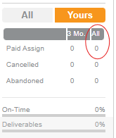

# Work Market Tech Hider
A web browser extension made to hide work market techs. When toggled on it will hide the profiles of any techs who do have no completed a job for your company in the past. Configurable filters is planned to be added.

 

**The circled field is what the extension uses to determine if a profile should be hidden. (In the 'yours' tab)**

0 = hidden. Anything else = not hidden. This value represents the total number of jobs a tech has completed for your company.

The extension reads the other values in the table (Cancelled jobs/Abandoned jobs) but currently does nothing else with them. These fields are a prime candidate for customizable filters (which will be added soon) since individuals/companies will have their own threshold for acceptable technicians.
