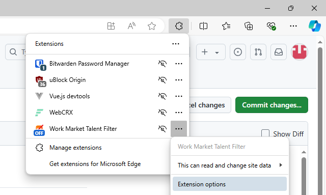

# Work Market Tech Hider
A web browser extension made to hide work market techs. When toggled on it will hide profiles of applicants to your ticket if they hit any of the following filters, which are individually toggleable.
- 0 Jobs
- 0 Jobs for your company
- Any abandoned jobs for your company
- Any abandoned jobs

 

*stop reviewing profiles that look like this!*

**By default, only 0 jobs for your company is on. To toggle these, press `extensions > 3 dots next to Work market tech hider > Extension options`**

**This is not meant to discriminate against new technicians on the platform, rather as a convenience tool for companies who have restrictions on what techs can be used for a job.**

## Installation Guide (For those who can't install through chrome web store or want to use it before its been approved there):
1. Download the [Release](https://github.com/giplgwm/Work-Market-Tech-Hider/releases/latest). Extract the folder that is inside the ZIP. This contains the extension.
2. Open Edge
3. (In edge) go to `Extensions > Manage Extensions` and enable `Developer Mode`
4. (In edge) At the top of the page press `Load unpacked` and select the folder you extracted from the Release zip file.
5. The extension should now be loaded. Tap the icon to switch between On and Off while on WorkMarket.
